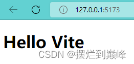
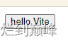
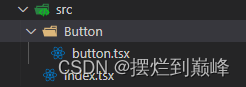
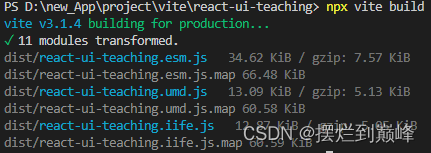
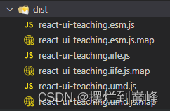
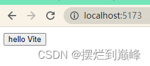

# 第一章：实现组件库的MVP
### MVP是什么？
MVP是最简化可实行产品；
也就是说，这一章我们要实现一个最简的组件库
#### 为什么使用vite？
 1. 基于 esbuild 实现极速开发
 2. 兼容 Rollup 的插件机制与API
 3. SSR 支持
 4. 旧浏览器支持

#### 为什么 Vite 基于 Esbuild可以实现极速开发？
 1. 语言优势：esbuild选择使用Go语言编写，在资源打包这种CPU密集场景下，Go性能最好
 2. 多线程优势：Go具有多线程运行的优势，esbuild的实现在尽可能饱和地使用各个CPU核，特别是打包过程的解析、代码生成阶段已经实现完全并行处理
 3. 节制：esbuild仅仅提供了构建一个现代web应用所需的最小功能集合，不会加入太多其他构建特性
### 为什么使用Pnpm对包进行管理？
 
 1. 安装迅速： 得益于它的包管理机制，节约了磁盘空间；pnpm会将依赖项存储在一个内容可寻址的仓库中，允许跨项目共享同一版本依赖；
 2. Monorepo：pnpm内置了对monorepo的支持，而且通过软链的方式同一管理node_modules，直接解决了幻影依赖和分身的问题

### 功能实现 
### 使用 Vite 搭建开发环境：
首先创建一个开发用的目录：
```
mkdir react-ui-teaching
cd react-ui-teaching
```
使用 pnpm 初始化软件包配置：
```
pnpm init
```
vite本身是有脚手架工具的，可以减少很多工程化配置工作；
但是作为一个需要长期维护的组件库，我们希望工程化细节由我们自己把控，也会让我们学到更多的东西：
安装vite：
```
pnpm i vite@latest -D
```
这里加上 -D ，是为了把vite安装到devDependencies对象中，这个是在开发环境才会用到，程序实际允许并不需要；
在根目录下创建一个index.html文件:
```
<!DOCTYPE html>
<html lang="en">
<head>
    <meta charset="UTF-8">
    <meta http-equiv="X-UA-Compatible" content="IE=edge">
    <meta name="viewport" content="width=device-width, initial-scale=1.0">
    <title>Document</title>
</head>
<body>
    <h1>Hello Vite</h1>
</body>
</html>
```
然后在命令行输入：
```
npx vite
```

vite无需任何配置就可以提供一个typescript开发环境，支持自动热更新；
我们改一下package.json中的npm script脚本：
```
"scripts":{
	+++++  "dev":"vite"
}
```
### 开发一个React组件
首先安装 react-dom 和 react ：
```
pnpm i react-dom@latest react@latest
```
修改根目录下的index.html：
```
<!DOCTYPE html>
<html lang="en">
  <head>
    <meta charset="UTF-8" />
    <link rel="icon" type="image/svg+xml" href="/vite.svg" />
    <meta name="viewport" content="width=device-width, initial-scale=1.0" />
    <title>Vite + React + TS</title>
  </head>
  <body>
    <div id="root"></div>
    <script type="module" src="/src/index.tsx"></script>
  </body>
</html>
```
根目录下新建src文件夹
src文件夹下新建文件index.tsx:
```
import React from "react";
import ReactDOM from "react-dom/client";
import SButton from "./Button/button";

ReactDOM.createRoot(document.getElementById("root") as HTMLElement).render(
  <React.StrictMode>
    <SButton>hello Vite</SButton>
  </React.StrictMode>
);
```
src文件夹下创建Button文件夹
Button文件夹下创建index.tsx:
```
import React, { Component } from "react";

interface ButtonProps {
  children?: string;
}

const SButton:React.FunctionComponent<ButtonProps> = (props) => {
  return (
    <button>
      {props.children ? props.children : ""}
    </button>
  );
};
export default SButton;
```
命令行输入：
```
pnpm dev
```
效果如下：


#####  配置vite打包规则
目前，我们项目的src目录结构时这样的：

首先，我们需要在src目录下再新建entry.ts文件作为组件库全量的输出口：
```
import SButton from "../Button/index";
export { SButton};
```
现在只有SButton这一个组件，所以就这样，这里需要import引入所有组件，然后一起export暴露输出；
然后，对于单个组件，我们也要有按需引入的考虑，在src/Button文件夹下，我们也新建entry.ts：
```
import SButton from "./index";
//导出单独组件
export { SButton};
```
安装 @vitejs/plugin-react ：
```
pnpm i @vitejs/plugin-react
```
安装 terser 代码压缩工具：
```
pnpm i terser
```
根目录下新建vite的配置文件 vite.config.ts：
```
import { defineConfig, UserConfig } from 'vite'
import react from '@vitejs/plugin-react'

export const config=({
  plugins: [
    react()
  ],
  build: {
    minify: 'terser', // boolean | 'terser' | 'esbuild'
    sourcemap: true, // 输出单独 source文件
    cssCodeSplit: true,
    lib: {
      entry: "./src/entry.ts",
      name: 'React-UI-Teaching',
      formats: ["esm", "umd","iife"],
      fileName: 'react-ui-teaching',
    },
    rollupOptions: {
      external: ['react'],
      output: {
        globals: {
          react: 'React'
        },
        extend: true,
        assetFileNames:()=> 'style.css'
      }
    },
    outDir: "./dist"
  }
})
export default defineConfig(config as UserConfig);
```
命令行输入：
```
npx vite build
```
结果如下：


在package.json中修改npm script：
```
  "scripts": {
+++++++++     "build":"vite build"
  }
```
尝试在代码中引入，修改src/index.tsx:
```
import React from "react";
import ReactDOM from "react-dom/client";
---------   import SButton from "./Button/index";
+++++++++   import {SButton} from '../dist/react-ui-teaching.esm';

ReactDOM.createRoot(document.getElementById("root") as HTMLElement).render(
  <React.StrictMode>
    <SButton>hello Vite</SButton>
  </React.StrictMode>
);
```
命令行输入：
```
pnpm dev
```
结果如下：

说明打包正常；
OK,目前为止，我们已近初步实现了一个react组件库的MVP；
下一章我们引入tailwindcss；