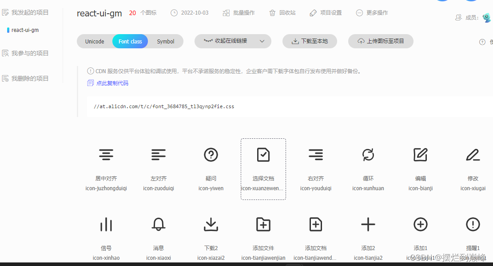
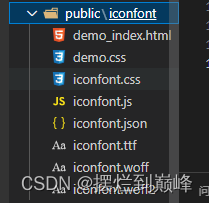
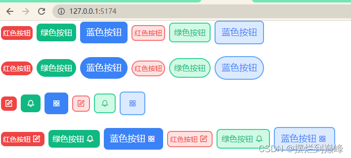

# 第二章：引入 Tailwindcss 实现原子化CSS
### 什么是原子化CSS？

 1. 原子化CSS是一种CSS的架构方式
 2. 倾向于使用小巧、用途单一的class定义样式
 3. 以class定义单一样式的方式，有效减少CSS包的体积
### 为什么选择Tailwindcss实现原子化CSS？
 4. Tailwindcss通过使用PurgeCSS来扫描打包产物并删除不需要的规则；
 5.  实现按需引入的Windicss原作者放弃，后续不看好
 6. 在尝试引入unocs时，发现在react tsx中使用className时使用`${}`模板字符串会导致样式失效
### PurgeCSS如何移除项目中不使用的CSS？
PurgeCSS要指定css会应用到哪些HTML文件中，会分析HTML中的CSS选择器，根据分析结果来删除没有用到的CSS
它一共会做两件事：
  
1. 提取html中可能的CSS选择器，包括id、class、tag等；
2. 分析CSS中的rule，根据选择器是否被使用，删除掉没用到的部分；
 
### 代码实现
首先，安装 Tailwindcss 到 devDependencies对象中：
```
pnpm i tailwindcss@2.2.19 postcss@latest autoprefixer@latest -D 
```
生成tailwindcss的配置文件：
```
npx tailwindcss init -p
```
在刚生成的tailwindcss配置文件 tailwind.config.js中配置 content 来指定pages和components文件，使得tailwind可以在生产构建中对未使用的样式进行树摇优化：
```
module.exports = {
  ++++++    content: ["index.html", "./src/**/*.{react,js,ts,jsx,tsx}"],
  purge: [],
  darkMode: false, // or 'media' or 'class'
  theme: {
    extend: {},
  },
  variants: {
    extend: {},
  },
  plugins: [],
}

```
然后需要在css中引入tailwindcss；
在src文件夹下创建index.css文件，并使用tailwind指令来包含tailwind的base、components和utilities样式，替换掉原来对的文件内容：
```
// src/index.css
@tailwind base;
@tailwind components;
@tailwind utilities;
```
在src/index.tsx中引入src/index.css:
```
import React from "react";
import ReactDOM from "react-dom/client";
import SButton from "./Button/index";
// import {SButton} from '../dist/react-ui-teaching.esm';
import "./index.css"

ReactDOM.createRoot(document.getElementById("root") as HTMLElement).render(
  <React.StrictMode>
      <SButton color="green" round>
        灰色按钮
      </SButton> 
  </React.StrictMode>
);
```

### 目前已经将tailwind引入到项目中，接下来我们设计一下组件SButton的样式，也就是设计一下API：
### API
Name | Description | Type | Default | Options
-----|-------|------|--------|------|
color | 有对颜色进行约束 | String | White| black \| gray \| red \| yellow \| green \| blue \| indigo \| purple \| pink
size | 目前只有三种，可自行覆盖样式 | String | medium | small \| medium \| large
plain | 对按钮朴素处理 | Boolean | false | true \| false
round | 对按钮进行圆角处理 | Boolean | false | true \| false
icon | 为按钮添加图标，或单独使用图标 | string | null | options如下

### Icon Options
Options | Description
--------|------------
juzhongduiqi|居中对齐
zuuoduiqi|左对齐
yiwen|疑问
xuanzewendnag|选择文档
youduiqi|右对齐
xunhuan|循环
bianji|编辑
xiugai|修改
xinhao|信号
xiaoxi|消息
xiazai2|下载2
tianjiawenjian|添加文件
tianjiawendang|添加文档
tianjia2|添加2
tianjia1|添加1
tixing|提醒1
tishi|提示
suoxiao|缩小
gongzuotai|工作台
zhichuhetong|支出合同


### 重写一下src/Button/index.tsx:
```
import React, { Component } from "react";

type ISize = "small" | "medium" | "large";
type IColor =
  | "black"
  | "gray"
  | "red"
  | "yellow"
  | "green"
  | "blue"
  | "indigo"
  | "purple"
  | "pink"
  | "white";
type IIcon =
  | ""
  | "juzhongduiqi"
  | "zuuoduiqi"
  | "yiwen"
  | "xuanzewendnag"
  | "youduiqi"
  | "xunhuan"
  | "bianji"
  | "xiugai"
  | "xinhao"
  | "xiaoxi"
  | "xiazai2"
  | "tianjiawenjian"
  | "tianjiawendang"
  | "tianjia2"
  | "tianjia1"
  | "tixing"
  | "tishi"
  | "suoxiao"
  | "gongzuotai"
  | "zhichuhetong";

interface ButtonProps {
  color?: IColor;
  icon?: IIcon;
  size?: ISize;
  round?: false | true;
  plain?: false | true;
  children?: string;
}

//上面这一部分用来限制输入的props的类型，比如color就只能是IColor中的其中一个，这样限制后，我们在写代码的时候，如果传入的值不在限制范围内，那么ts会直接报错；

const SButton= (props:ButtonProps) => {
  const sizeOptions: Record<string, Record<string, string>> = {
    small: {
      x: "1",
      y: "1",
      text: "sm",
    },
    medium: {
      x: "1.5",
      y: "2",
      text: "base",
    },
    large: {
      x: "2",
      y: "3",
      text: "lg",
    },
  };
  return (
    <button
      className={`
      mx-1          //原子css
      ${ 
      props.size
          ? `px-${sizeOptions[props.size].y} py-${
              sizeOptions[props.size].x
            } text-${sizeOptions[props.size].text}`
          : ""
      }
      ${props.round ? "rounded-full" : "rounded-lg"}
      bg-${props.color}-${props.plain ? "100" : "500"}
      ${
        props.plain
          ? `border-2 border-${props.color}-400 hover:bg-white-200 hover:text-${props.color} text-${props.color}-500 border-solid`
          : `hover:bg-${props.color}-400 hover:text-white text-white`
      }
      cursor-pointer transition duration-300 ease-in-out transform hover:scale-105
    `}
    >
      {props.children ? props.children : ""}
    </button>
  );
};

SButton.defaultProps = {//为函数组件的props添加默认值
  color: "white",
  icon: "",
  size: "medium",
  round: false,
  plain: false,
};
export default SButton;

```
最后，
### 做一下icon的处理：
本身Tailwindcss是带有icon库的，也就是 heroicons；
但是 heroicons无法通过tsx标签中的className来展示图标，故我们放弃使用herocions，选择引入阿里的iconfont；

我们将想要引入支持的图标放到一个项目里，然后考虑引入方法；
这里是有直接下载和动态链接两种引入方式的；
由于动态连接受网速影响比较大，而且连接不稳定，故我们最后选择直接将需要的icon文件下载到本地；
下载后在根目录下新建public文件夹，里面新建iconfont文件夹，把下载的icon文件放到里面：

在src/index.tsx中引入iconfont文件：
```
import React from "react";
import ReactDOM from "react-dom/client";
import SButton from "./Button/index";
// import {SButton} from '../dist/react-ui-teaching.esm';
import "./index.css"
++++++++     import "../public/iconfont/iconfont.css"

ReactDOM.createRoot(document.getElementById("root") as HTMLElement).render(
  <React.StrictMode>
      <SButton color="green" round>
        灰色按钮
      </SButton> 
  </React.StrictMode>
);
```
在src下新建Icon文件夹，新建index.tsx文件：
```
import React,{ ReactElement } from "react";
import '../../public/iconfont/iconfont.css'

interface iconProps{
    iconName:string | undefined;
    customClassName?:string;
    onIconClick?:()=>void;
}

function Icon(props:iconProps):ReactElement {
    const {iconName,customClassName,onIconClick}=props;

    const handleIcon=()=> onIconClick?.();

    return (
        <span className={customClassName}>
            <i className={`iconfont icon-${iconName}`} onClick={handleIcon}></i>
        </span>
    );
}

export default Icon;
```
在SButton中引入Icon，修改src/Button/index.tsx:
```
import React, { Component } from "react";
++++++  import Icon from "../Icon";
···········································································
type ISize = "small" | "medium" | "large";
·····················································
  return (
    <button
    ·········································
    >
      {props.children ? props.children : ""}
+++     {props.icon!="" ? (
+++          <Icon
+++            iconName={props.icon}
+++            customClassName="p-1"
+++            onIconClick={() => {
+++            console.log("onClick 1");
+++          }}
+++          />
+++       ) : (
+++         ""
+++       )}
    </button>
  );
};

SButton.defaultProps = {
  color: "white",
  icon: "",
  size: "medium",
  round: false,
  plain: false,
};
export default SButton;
```
修改一下src/index.tsx:
```
import React from "react";
import ReactDOM from "react-dom/client";
import SButton from "./Button/index";
// import {SButton} from '../dist/react-ui-teaching.esm';
import "./index.css"
import "../public/iconfont/iconfont.css"

ReactDOM.createRoot(document.getElementById("root") as HTMLElement).render(
  <React.StrictMode>
      <div>
      <SButton color="red" size="small">红色按钮</SButton>
      <SButton color="green" size="medium">绿色按钮</SButton>
      <SButton color="blue" size="large">蓝色按钮</SButton>
      <SButton color="red" size="small" plain>红色按钮</SButton>
      <SButton color="green" size="medium" plain>绿色按钮</SButton>
      <SButton color="blue" size="large" plain>蓝色按钮</SButton>
    </div>
    <br/>
    <div>
      <SButton color="red" size="small" round>红色按钮</SButton>
      <SButton color="green" size="medium" round>绿色按钮</SButton>
      <SButton color="blue" size="large" round>蓝色按钮</SButton>
      <SButton color="red" size="small" plain round>红色按钮</SButton>
      <SButton color="green" size="medium" plain round>绿色按钮</SButton>
      <SButton color="blue" size="large" plain round>蓝色按钮</SButton>
    </div>
    <br/>
    <div>
      <SButton color="red" size="small" icon="bianji"></SButton>
      <SButton color="green" size="medium" icon="xiaoxi"></SButton>
      <SButton color="blue" size="large" icon="gongzuotai"></SButton>
      <SButton color="red" size="small" plain icon="bianji"></SButton>
      <SButton color="green" size="medium" plain icon="xiaoxi"></SButton>
      <SButton color="blue" size="large" plain icon="gongzuotai"></SButton>
    </div>
    <br/>
    <div>
      <SButton color="red" size="small" icon="bianji">红色按钮</SButton>
      <SButton color="green" size="medium" icon="xiaoxi">绿色按钮</SButton>
      <SButton color="blue" size="large" icon="gongzuotai">蓝色按钮</SButton>
      <SButton color="red" size="small" plain icon="bianji">红色按钮</SButton>
      <SButton color="green" size="medium" plain icon="xiaoxi">绿色按钮</SButton>
      <SButton color="blue" size="large" plain icon="gongzuotai">蓝色按钮</SButton>
    </div>
  </React.StrictMode>
);
```
命令行输入：
```
pnpm dev
```
效果如下：

OK，到目前为止，Tailwindcss我们已经引入成功！