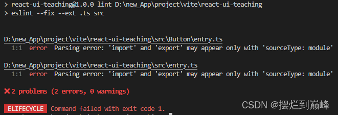
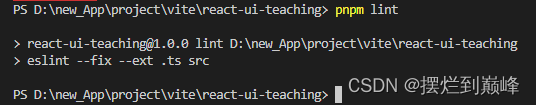
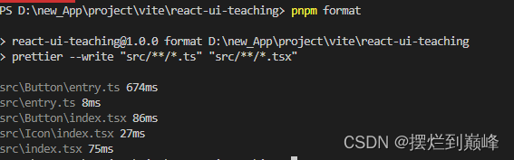
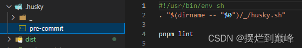
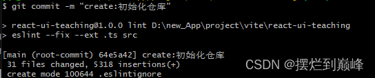

# 第三章：为组件库添加规范
本章我们会用 eslint、prettier以及Husky 为组件库添加规范；
### 前置知识：
##### eslint、prettier和husky各有什么作用？

 1. eslint是代码检查工具，你可以配置eslint，然后通过lint命令检测代码是否符合你配置的规则；
 2. prettier是代码格式化工具，可以自己配置，配置之后可以按照规则格式化代码；
 3. husky是一个钩子，让我们方便的向项目中添加git hook，以便于在提交代码前对代码进行检查和格式化校验；
 ##### eslint实现的原理是什么？
 eslint的实现原理其实就是先转化成AST抽象语法树，基于AST做检查，然后基于字符串做代码fix：
 
 4. preprocess把非js文本处理为js
 5. 确定parser解析器
 6. 调用parser，通过parser把文件转换成SourceCode，也就是抽象语法树
 7. 调用rules，对AST进行检查，返回linting problems
 8. 通过postprocess对linting problems做处理
 9. 基于字符串的替换做代码fix
##### prettier实现的原理是什么？
 10. 将代码解析成AST树
 11. 对AST遍历
 12. 调整长句
 13. 整理符号
 14. 用统一固定的格式重新输出
##### husky实现的原理是什么？
husky的原理其实就是更改了git hook执行的路径，在这个路径下新建配置的hook执行文件；
##### AST是如何生成的？
AST是通过JS Parser将js源码转化为抽象语法树：
 15. 分词：将整个代码字符串分割成语法单元数组（token）；
 16. 语义分析：将分词得到的语法单元进行一个整体的组合，分析确定语法单元之间的关系，语法分析可以理解成对语句和表达式的识别
### 配置Eslint和Prettier：
安装一堆软件包：
```
pnpm i prettier eslint @typescript-eslint/parser @typescript-eslint/eslint-plugin -D
```
根目录下新建文件 .eslintrc.cjs 和 .eslintignore:
```
//   .eslintrc.cjs
module.exports =   {
    root: true,
    env: {
      browser: true,
      es2020: true,
      node: true,
      jest: true
    },
    globals: {
      ga: true,
      chrome: true,
      __DEV__: true
    },
    plugins: ['@typescript-eslint'],
    parserOptions: {
      parser: '@typescript-eslint/parser', // 解析 .ts 文件
      //sourceType: 'module'
    },
    rules: {
      'no-console': process.env.NODE_ENV === 'production' ? 'warn' : 'off',
      'no-debugger': process.env.NODE_ENV === 'production' ? 'warn' : 'off',
      "prettier/prettier": "off"
    }
  }
```
```
//   .eslintignore
*.sh
node_modules
lib
coverage
*.md
*.scss
*.woff
*.ttf
src/index.ts
dist
```
修改根目录下的package.json:
```
  "scripts": {
    "dev": "vite",
    "build": "vite build",
    "test": "vitest",
    "coverage": "vitest run --coverage",
    +++++ "lint": "eslint --fix --ext .ts src",
    +++++ "format": "prettier --write \"src/**/*.ts\" \"src/**/*.tsx\""

  },
```
命令行键入：
```
pnpm lint
```
结果如下：

这就是eslint发挥作用了；
修改这个问题我们只需要将 .eslintrc.cjs 文件中的parseOptions的注释去掉：
```
    parserOptions: {
      parser: '@typescript-eslint/parser', // 解析 .ts 文件
      sourceType: 'module'
    },
```
再次运行 pnpm lint：

errors消失了；
命令行键入：
```
pnpm format
```
效果：

代码成功格式化，prettier生效；
### 配置 Husky:
安装：
```
pnpm i huksy -D
```
添加 husky 脚本：
```
"scripts": {
    "dev": "vite",
    "build": "vite build",
    "test": "vitest",
    "coverage": "vitest run --coverage",
    "lint": "eslint --fix --ext .ts src",
    "format": "prettier --write \"src/**/*.ts\" \"src/**/*.tsx\"",
    "prepare": "husky install"
  },
```
然后命令行键入：
```
pnpm i
```
"prepare":"husky install" 会在 pnpm i 完成之后执行，然后在根目录下生成.husky文件夹；
添加生命周期钩子：
```
npx husky add .husky/pre-commit "pnpm lint"
```
在 .huksy目录下生成了 pre-commit 文件 ：

现在，我们用git 去 commit一下我们的代码，效果如下：


可以看到，eslint在commit之前运行了；

我们也可以在push之前进行单元测试：
```
npx husky add .husky/pre-push "pnpm test"
```
这个就不演示了；
OK，组件库的规范就差不多了，如果需要还可以引入一个commitlint来规范commit message，然后通过husky放到git hook中，让每次提交前都验证一个commit message是否符合规范；
