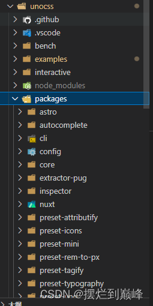
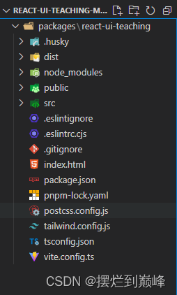
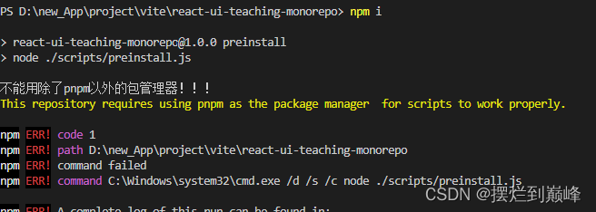

# 第四章：利用Monorepo方式管理组件库生态
### 前置知识：
##### 什么是Monorepo？
Monorepo 的意思是在版本控制系统的单个代码库包含很多其他项目的代码；

Unocss源码就是典型的Monorepo项目；
##### Monorepo方式的优势是什么？

 1. 每个开发者可以方便地查看多个包的代码，方便跨Package修改BUG；
 2. 因为多个package共享依赖，所有模块都托管在同一个存储库，因此不需要有私有包管理器
 3. 由于共享依赖，每个依赖只有一个版本，可以防止版本冲突

### 代码实现：
我们选择使用 pnpm workspace来实现；
首先，修改软件包的目录结构：
```
|---  packages
|     |--- react-ui-teaching
|     |     |--- package.json
|--- package.json
```
修改后是这样：


目前的根目录是 react-ui-teaching-monorepo 文件夹;
在根目录初始化pnpm：
```
pnpm init
```
然后我们需要在软件包中禁止使用yarn和npm，只允许使用pnpm，不然多个packages可能会出现不兼容的问题；
我们先写一个检查脚本：
根目录下新建 scripts 文件夹，里面新建preinstall.js:
```
// ./scripts/perinstall.js
if (!/pnpm/.test(process.env.npm_execpath || '')) {
  console.log('不能用除了pnpm以外的包管理器！！！')
  console.warn(
    `\u001b[33mThis repository requires using pnpm as the package manager ` +
      ` for scripts to work properly.\u001b[39m\n`
  )
  process.exit(1)
}
```
我们将这个脚本的命令通过npm script挂到git hooks中：
```
//  ./package.json

{
  "name": "react-ui-teaching-monorepo",
  "version": "1.0.0",
  "description": "",
  "main": "index.js",
  "scripts": {
    "test": "echo \"Error: no test specified\" && exit 1",
      "preinstall": "node ./scripts/preinstall.js"
  },
  "keywords": [],
  "author": "",
  "license": "ISC"
}
```
让我们验证一下：
```
npm i
```
效果如下：


npm命令已经被拦截；
### 初始化工作空间：
在Monorepo项目中，每个软件包会存放在工作空间；
我们将所有软件包都放在了 ./packages 中，所以需要声明一个这个路径；
根目录下新建文件 pnpm-workspace.yaml：
```
packages:
	- ' packages/** '
```
### 将项目推送到github上：
github有很方便的自动化部署action，以及后面的Netlify都需要gituhub；
我们在github上新建代码仓库：react-ui-teaching；
然后通过git将代码推送到主分支上
其他的后面几章再慢慢配置；
