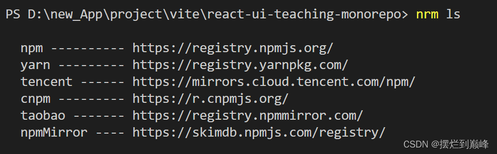
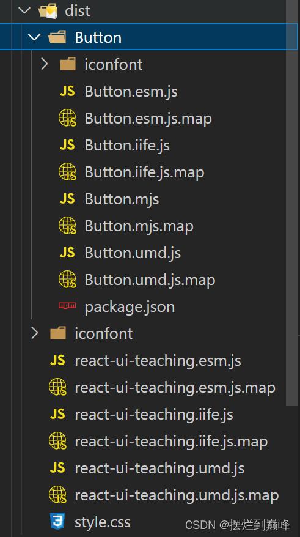
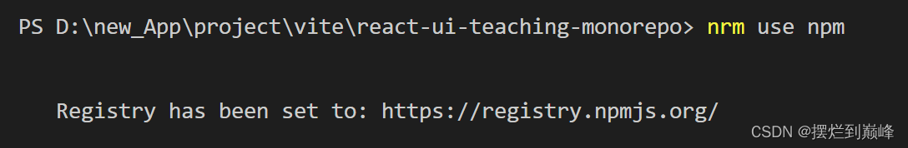
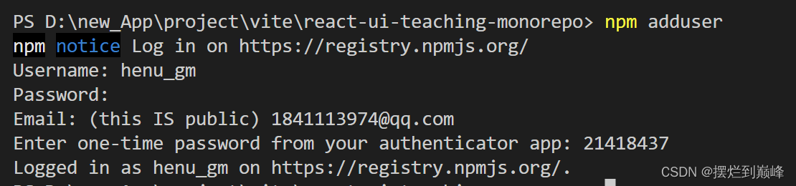
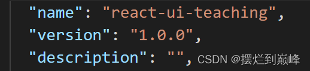
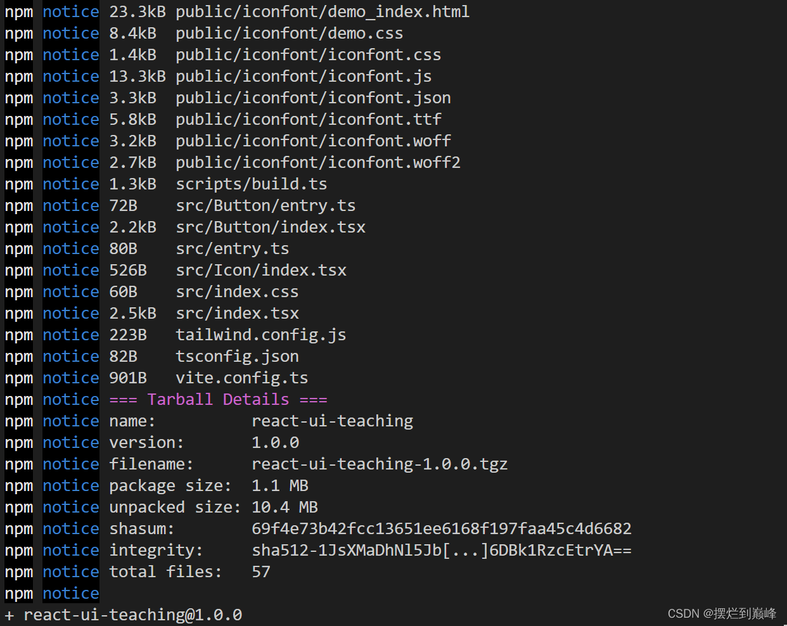

# 第五章：将组件库发布到npm
### 前置知识：
##### 为什么要使用nrm管理npm源？

 1. 在安装项目依赖库的时候，如果一直使用npm官方源会非常慢，所以我们经常切换到taobao或者tencent，然后在发包的时候我们又需要换回官方源，会比较麻烦；
 2. 有些公司团队会有自己的npm源，使用nrm add也可以添加自己团队的源，非常方便；
### 代码实现：
安装nrm：
```
npm i -g nrm
 ```
查看有哪些可以使用的源：
```
nrm ls
```


##### vite打包处理：
在src/entry.ts中引入index.css否则无法打包css：
```
import SButton from "./Button/index";
+++++   import './index.css'

export { SButton };
```
为了实现按需加载，我们需要为每个小组件单独打包，写一个脚本实现：
组件库根目录下新建 scripts/build.ts :
```
import * as fs from "fs-extra";
import * as path from "path";
import {config} from "../vite.config";
import { build, InlineConfig, defineConfig, UserConfig } from "vite";
const buildAll = async () => {

  await build(defineConfig(config as UserConfig) as InlineConfig);

  const srcDir = path.resolve(__dirname, "../src/");
  fs.readdirSync(srcDir)
    .filter((name) => {
      const componentDir = path.resolve(srcDir, name);
      const isDir = fs.lstatSync(componentDir).isDirectory();
      return isDir && fs.readdirSync(componentDir).includes("entry.ts");
    })
    .forEach(async (name) => {
      const outDir = path.resolve(config.build.outDir, name);
      const custom = {
        lib: {
          entry: path.resolve(srcDir, name),
          name, 
          fileName: name,
          formats: [`esm`,`es`, `umd`],
        },
        outDir,
      };

      Object.assign(config.build, custom);
      await build(defineConfig(config as UserConfig) as InlineConfig);

      fs.outputFile(
        path.resolve(outDir, `package.json`),
        `{
          "name": "react-ui-teaching/${name}",
          "main": "index.umd.js",
          "module": "index.umd.js",
        }`,
        `utf-8`
      );
    });
};

buildAll();
```
为了在node环境下直接允许ts文件，我们需要安装一个esno：
```
pnpm i esno
```
然后在package.json的script中重新配置一下：
```
  "scripts": {
    "dev": "vite",
    "test": "vitest",
    +++++ "build": "esno ./scripts/build.ts",
    "coverage": "vitest run --coverage",
    "lint": "eslint --fix --ext .ts src",
    "format": "prettier --write \"src/**/*.ts\" \"src/**/*.tsx\"",
    "prepare": "husky install"
  },
```
为了通过引入react-ui-teaching直接暴露esm源文件，我们还需要配置package.json的module字段指向esm文件：
```
{
  "name": "react-ui-teaching",
  "version": "1.0.0",
  "description": "",
  +++++  "module": "./dist/react-ui-teaching.esm.js",
```
命令行打包试一下：
```
pnpm build
```
打包结果如下：


在我们将组件库react-ui-teaching发布到npm之前，我们先将npm源切换到官方源：
```
nrm use npm
```


然后我们需要有一个npm的账号：https://www.npmjs.com/signup
完成登录注册之后，我们在项目根目录cmd键入：
```
npm adduser
```


最后检查一下package.json中的配置是不是自己想要的：


确认之后，命令行键入：
```
npm publish
```


### 验证效果：
我们在packages下新建项目react-ui-teaching-template来试一试刚发布的组件库：
```
cd packages
pnpm create vite react-ui-teaching-template --template react
nrm use taobao // 记得要及时换回taobao源
```
```
cd react-ui-teaching-template 
pnpm i
pnpm i react-ui-teaching
```
在template中使用react-ui-teaching：
src/main.jsx:
```
import React from 'react'
import ReactDOM from 'react-dom/client'
import App from './App'
import './index.css'
+++++++    import "react-ui-teaching/dist/style.css"
ReactDOM.createRoot(document.getElementById('root')).render(
  <React.StrictMode>
    <App />
  </React.StrictMode>
)
```
src/App.jsx:
```
import { useState } from 'react'
++++++    import {SButton} from 'react-ui-teaching' 
import './App.css'

function App() {
  return (
    <div className="App">
      +++++++  <SButton color="red" plain>hello</SButton>
    </div>
  )
}
export default App
```
命令行键入：
```
pnpm dev
```
效果如下：


引入成功；
像自动化部署这些配置，我会专门拿出一章来讲；
