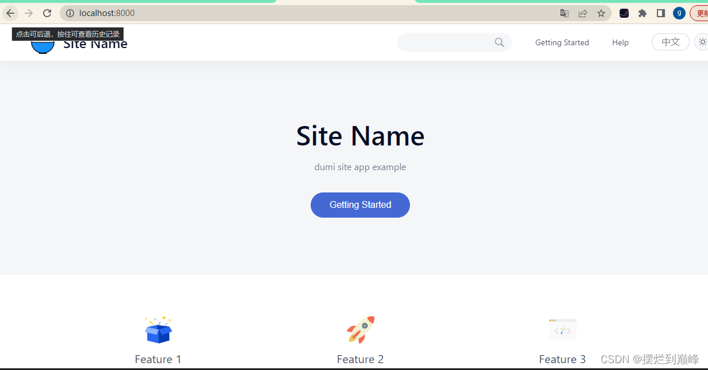
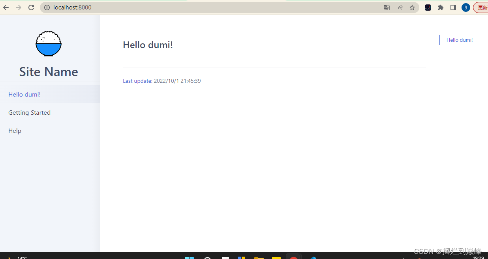
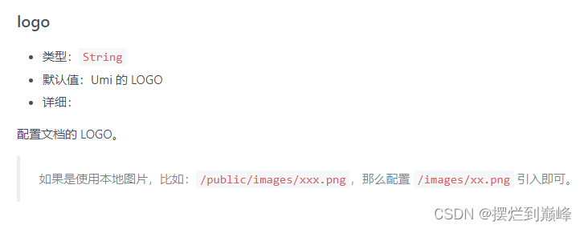
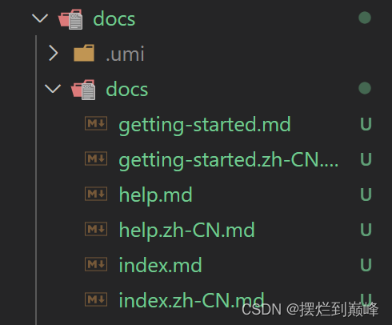
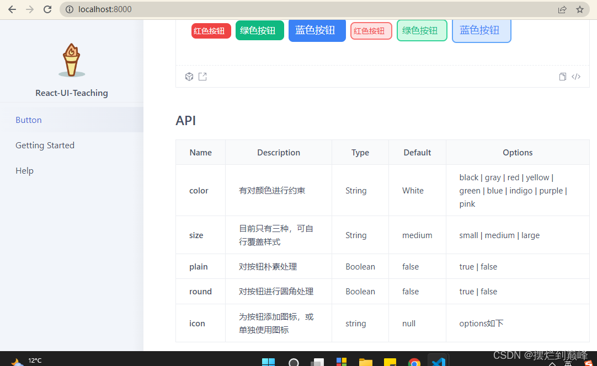

# 第六章：利用dumi搭建组件文档
### 为什么使用dumi？
目前前端生态中可以搭建文档的有：

 1. VuePress
 2. VitePress
 3. Dumi
 4. Gatsby
 5. Docz
 6. Docusaurus
由于我们组件库是react技术栈，故vuepress和没适配react的vitepress排除掉，vitepress-rc不好用；
然后综合剩下的几个，Dumi以优秀齐全的中文文档和建设效果取胜；
### 代码实现：
初始化项目：
```
cd packages
mkdir docs 
cd docs
pnpm create @umijs/dumi-app
pnpm i dumi
```
运行看一下效果：
```
pnpm i
pnpm start
```


默认打开的是站点模式，组件文档不需要那么花里胡哨，我们改成文档模式：
```
// .umirc.ts
import { defineConfig } from 'dumi';

export default defineConfig({
  title: 'Site Name',
  -----     mode: 'site',
  +++++     mode: 'doc',
  // more config: https://d.umijs.org/config
});
```
看看效果：


通过配置项修改文档logo：


我们把准备好的logo放到docs项目的public的images文件夹中，然后。修改.umirc.ts:
```
import { defineConfig } from 'dumi';

export default defineConfig({
  title: 'Site Name',
  mode: 'doc',
  +++++     logo:"/images/torch.png"
  // more config: https://d.umijs.org/config
});
```
看看效果：


可以看到文档中的logo已经修改好了，但是上面tab的icon还没有替换：
```
// .umirc.ts
import { defineConfig } from 'dumi';

export default defineConfig({
  ++++++ ------ title: 'React-UI-Teaching',
  mode: 'doc',
  logo:"/images/torch.png",
  +++++     links:[
  +++++       {
  +++++         rel:'icon',href:'/images/torch.png',type:'image/x-icon'
  +++++       }
  +++++     ]
  // more config: https://d.umijs.org/config
});
```


然后具体的md文档在docs/docs文件夹下写：


下面看看如何在文档中用jsx：
先安装一下我们的react-ui-teaching
```
pnpm i react-ui-teaching
```

修改docs/docs/index.md:
```
jsx
import React from 'react';
import {SButton} from 'react-ui-gm'
import 'react-ui-gm/dist/style.css'
export default () => 
<>
    <div>
      <SButton color="red" size="small">红色按钮</SButton>
      <SButton color="green" size="medium">绿色按钮</SButton>
      <SButton color="blue" size="large">蓝色按钮</SButton>
      <SButton color="red" size="small" plain>红色按钮</SButton>
      <SButton color="green" size="medium" plain>绿色按钮</SButton>
      <SButton color="blue" size="large" plain>蓝色按钮</SButton>
    </div>
    <br/>
    <div>
      <SButton color="red" size="small" round>红色按钮</SButton>
      <SButton color="green" size="medium" round>绿色按钮</SButton>
      <SButton color="blue" size="large" round>蓝色按钮</SButton>
      <SButton color="red" size="small" plain round>红色按钮</SButton>
      <SButton color="green" size="medium" plain round>绿色按钮</SButton>
      <SButton color="blue" size="large" plain round>蓝色按钮</SButton>
    </div>
    <br/>
    <div>
      <SButton color="red" size="small" icon="bianji"></SButton>
      <SButton color="green" size="medium" icon="xiaoxi"></SButton>
      <SButton color="blue" size="large" icon="gongzuotai"></SButton>
      <SButton color="red" size="small" plain icon="bianji"></SButton>
      <SButton color="green" size="medium" plain icon="xiaoxi"></SButton>
      <SButton color="blue" size="large" plain icon="gongzuotai"></SButton>
    </div>
    <br/>
    <div>
      <SButton color="red" size="small" icon="bianji">红色按钮</SButton>
      <SButton color="green" size="medium" icon="xiaoxi">绿色按钮</SButton>
      <SButton color="blue" size="large" icon="gongzuotai">蓝色按钮</SButton>
      <SButton color="red" size="small" plain icon="bianji">红色按钮</SButton>
      <SButton color="green" size="medium" plain icon="xiaoxi">绿色按钮</SButton>
      <SButton color="blue" size="large" plain icon="gongzuotai">蓝色按钮</SButton>
    </div>
</>;

## API
Name | Description | Type | Default | Options
-----|-------|------|--------|------|
color | 有对颜色进行约束 | String | White| black \| gray \| red \| yellow \| green \| blue \| indigo \| purple \| pink
size | 目前只有三种，可自行覆盖样式 | String | medium | small \| medium \| large
plain | 对按钮朴素处理 | Boolean | false | true \| false
round | 对按钮进行圆角处理 | Boolean | false | true \| false
icon | 为按钮添加图标，或单独使用图标 | string | null | options如下

## Icon Options
Options | Description
--------|------------
juzhongduiqi|居中对齐
zuuoduiqi|左对齐
yiwen|疑问
xuanzewendnag|选择文档
youduiqi|右对齐
xunhuan|循环
bianji|编辑
xiugai|修改
xinhao|信号
xiaoxi|消息
xiazai2|下载2
tianjiawenjian|添加文件
tianjiawendang|添加文档
tianjia2|添加2
tianjia1|添加1
tixing|提醒1
tishi|提示
suoxiao|缩小
gongzuotai|工作台
zhichuhetong|支出合同
```
命令行键入：
```
pnpm start
```
效果如下：


下一章我们通过netlify部署一下文档；