# 第七章：使用Netlify无成本发布组件文档
### 为什么使用Netlify？
一开始一共有三个方案：
1、Github Page
2、Netlify
3、Vercel
Github Page只支持一个repo发布一个网站，而我们的项目是一个mononrepo项目，后续可能还有其他需要部署的项目，pass掉；
通过实操，目前通过vercel部署的网站正常无法访问，翻墙也不行，pass掉；
### 实操：
[Netlify官网](https://www.netlify.com/)
进入官网，点击右上角sign up；
选择github注册：


点击add new site：
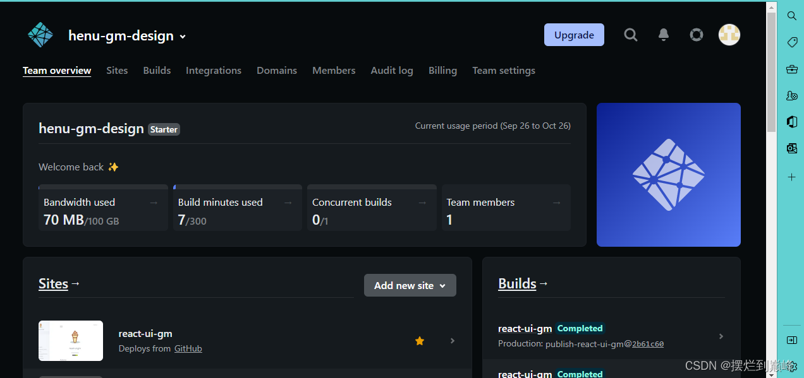

然后：Import an existing project
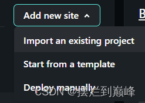

选择github:
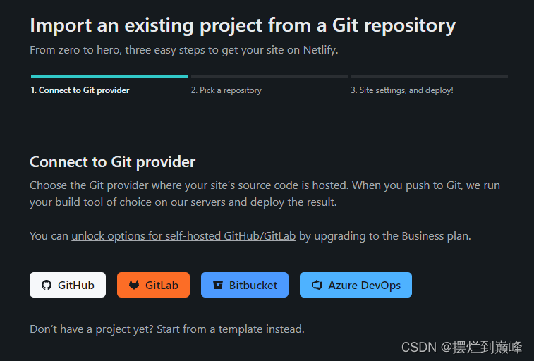

然后选择github账号中的repo：
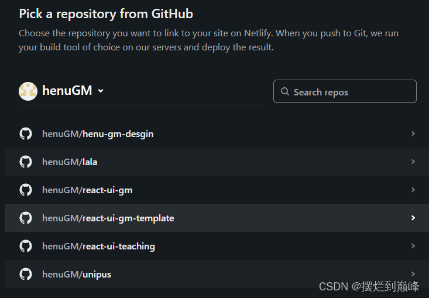

选择react-ui-teaching，然后：
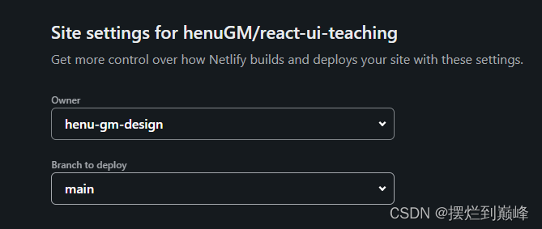

选择分支；
设置build配置：
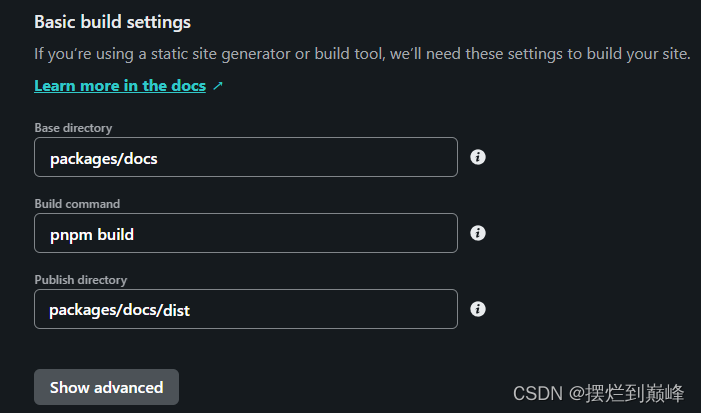

等待build部署：
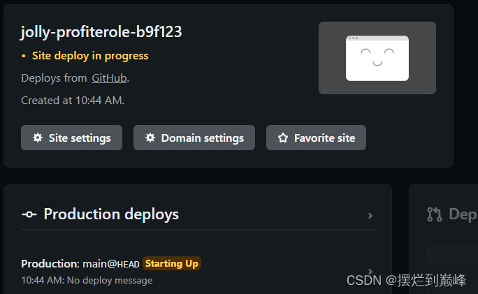

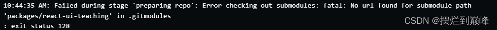

显示缺少.gitmodules文件:
原因是我们的monorepo项目中个子项目react-ui-teaching;
我们可以将monorepo项目名字修改为react-ui-teaching-monorepo；
然后新建一个repo放置子项目，这样可以互不干扰；
然后将子项目push到github；
在monorepo项目根目录下新建文件 .gitmodules:
```
[submodule "react-ui-teaching"]
	path = packages/react-ui-teaching
	url = https://github.com/henuGM/react-ui-teaching
```
push之后再重新试一下：
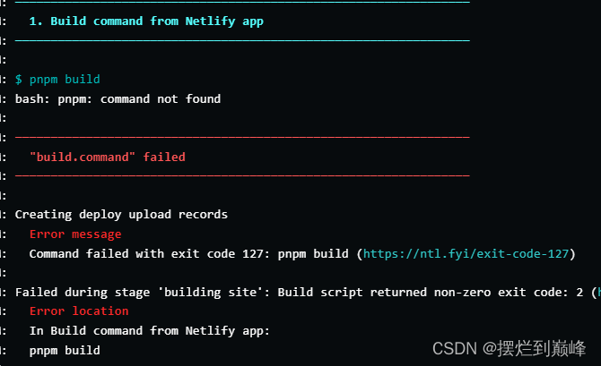

command错误，这样，我们直接使用npx dumi build命令构建：
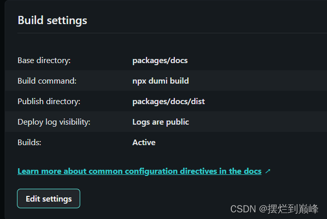

再试一次；
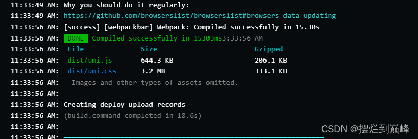

构建成功；
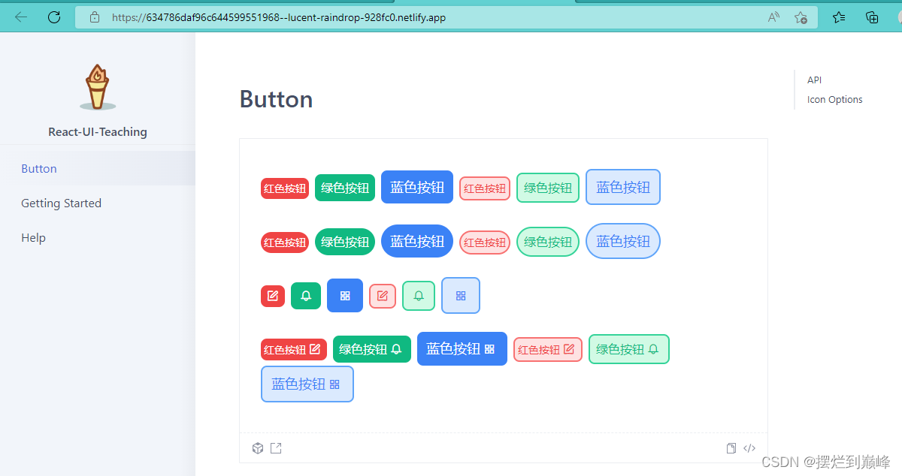


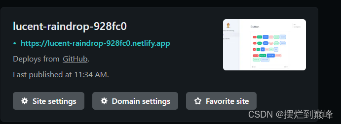


点domian setting：
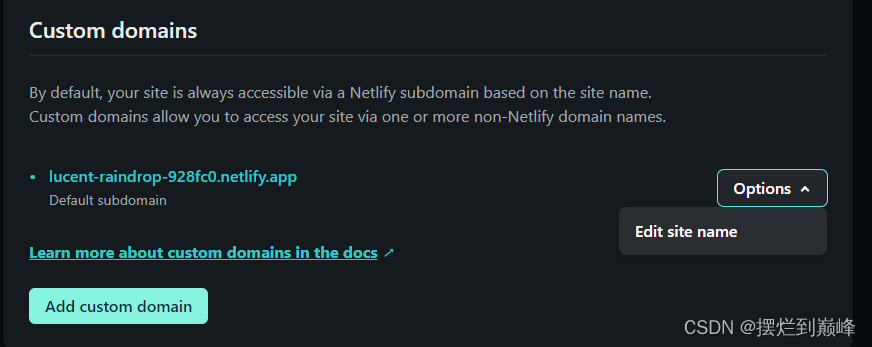

Edit site name:
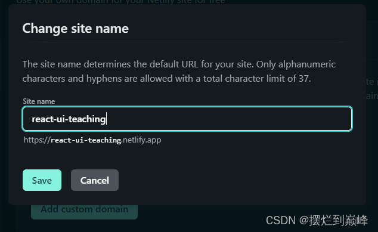
修改成功：
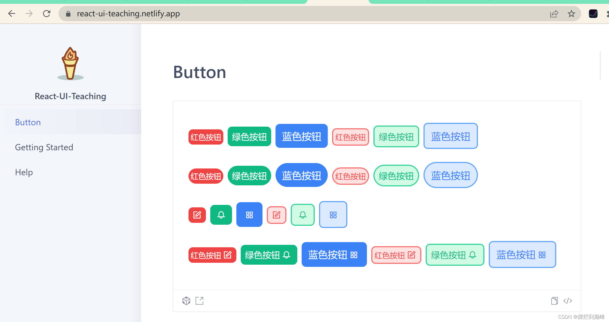


